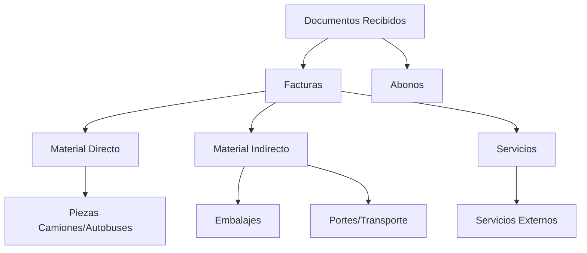
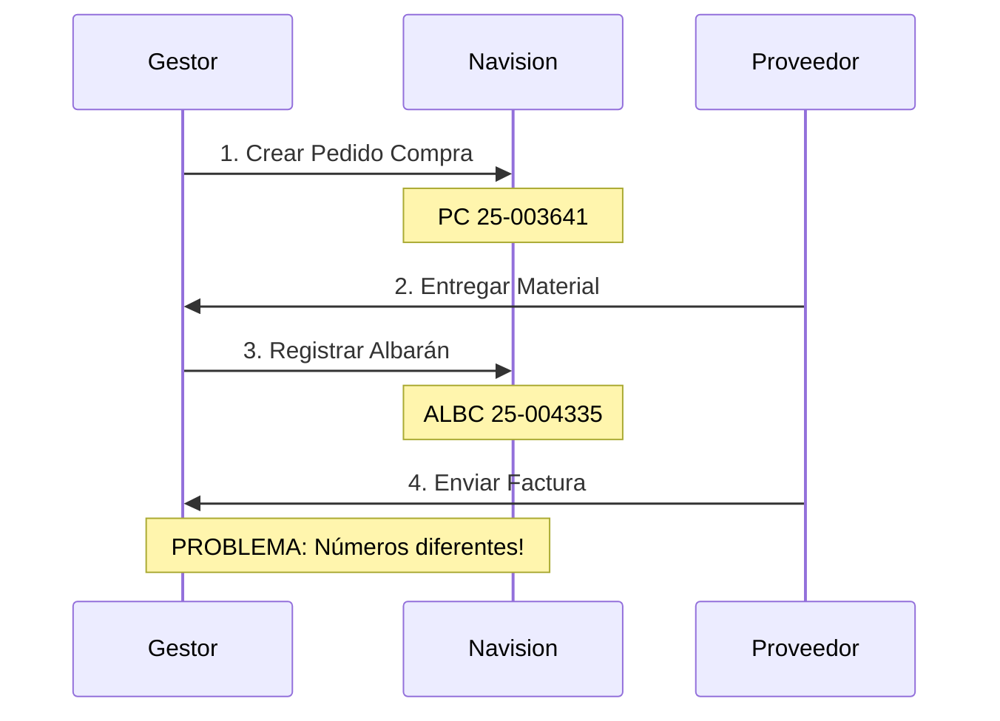
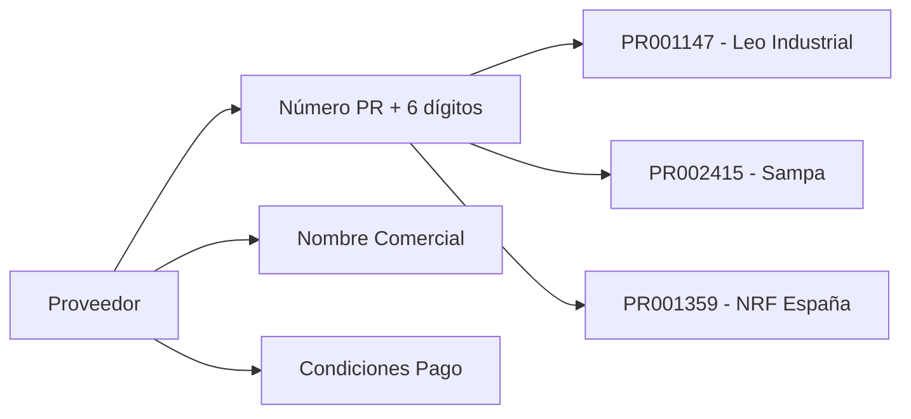
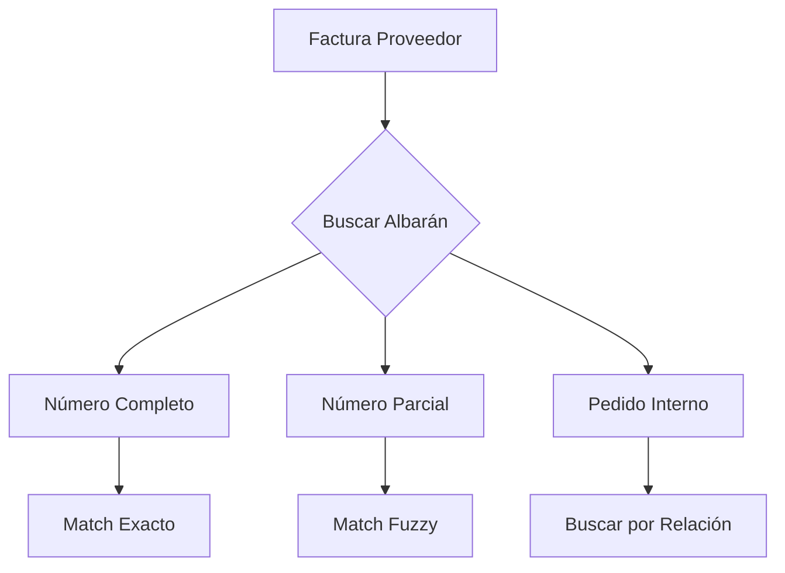
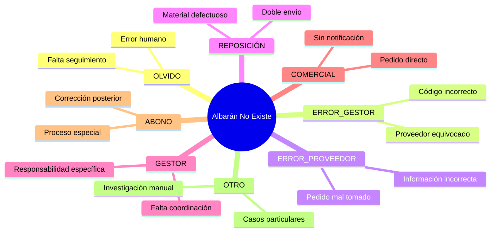

# Esquema Factura Compra

:::info Fuente de la Información
Esta documentación está basada en la presentación compartida por **Olga Manzano (DIESSA)** el 6 de agosto de 2025, donde detalla el proceso manual actual de facturación de compras.

📄 **Presentación original**: [ESQUEMA FACTURA COMPRA_2.ppsx](/assets/ESQUEMA%20FACTURA%20COMPRA_2.ppsx) *(haz click para abrir)*
:::

## Clasificación y Tipología de Facturas

### Tipos Principales de Documentos



### Categorización por Material

#### 🔧 **Material DIRECTO (Piezas)**
- **Descripción**: Piezas específicas para camiones y autobuses
- **Gestión**: Proceso completo Pedido → Albarán → Factura
- **Responsabilidad**: 100% gestionado por gestores
- **Códigos**: Normalmente empiezan por C, K, o M

#### 📦 **Material INDIRECTO**
- **Embalajes**: Cuenta específica `60000000005`
- **Portes/Transporte**: Gestión separada, pueden aparecer al inicio y mitad de facturas
- **Características**: No siempre aparecen en ambos documentos (problema identificado)

---

## Flujo de Facturación Directa

### Secuencia Obligatoria



### 🚨 **Problema Crítico Identificado**

**Los números de pedido son "totalmente diferentes" entre sistemas:**

| Sistema | Formato | Ejemplo |
|---------|---------|---------|
| **Pedido Compra** | PC 25-XXXXXX | PC 25-003641 |
| **Albarán Compra** | ALBC 25-XXXXXX | ALBC 25-004335 |

:::warning Desafío de Matching
Esta diferencia de numeración es una de las causas principales de las **196 variaciones de formato** que dificultaban el matching automático antes del breakthrough técnico.
:::

---

## Campos Obligatorios en Navision

### Información de Proveedor



### Campos de Fechas

| Campo | Descripción | Validación |
|-------|-------------|------------|
| **Fecha Documento** | Fecha que aparece en factura proveedor | Manual |
| **Fecha Registro** | Día entrada al sistema DIESSA | Automática (hoy) |
| **Fecha Vencimiento** | Según condiciones de pago | Auto + Validación manual |

### 📅 **Adaptación SII (Sistema Información Inmediata)**

:::caution Próximos Cambios
En los próximos meses, las fechas deberán adaptarse al **Sistema de Información Inmediata**. Requiere validaciones automáticas:
- Sistema bloquea registro de fechas posteriores
- Comparación fechas vencimiento con condiciones proveedor
- Check points para alertas de discrepancias
:::

---

## Problemas con Matching Albaranes-Facturas

### Criterios de Comparación

#### 🗓️ **1. Ventana Temporal**
```
Período de búsqueda: [Mes Anterior] + [Mes Actual]
```

#### 🔢 **2. Número de Albarán**
**Flexibilidad requerida**: Los gestores pueden usar:
- **Albarán completo del proveedor** 
- **Número de pedido interno** (completo o parcial)



#### 🏷️ **3. Códigos de Producto**
**Mapeo necesario**: Códigos diferentes entre sistemas proveedor-DIESSA

| Proveedor | DIESSA | Resultado |
|-----------|--------|-----------|
| Ref-ABC-123 | C001234 | ✅ Match |
| XYZ-789 | K005678 | ⚠️ Requiere mapeo |

### Casos Especiales: Portes y Embalajes

#### 🚛 **Portes/Transporte**
- **Problema**: No siempre aparecen en ambos documentos
- **Gestión**: Pueden aparecer al inicio Y en la mitad de facturas (Diesel Technic)
- **Solución requerida**: El sistema debe detectar y manejar esta variabilidad

#### 📦 **Embalajes** 
- **Cuenta específica**: `60000000005`
- **Renombrado**: Como "Embalajes" en sistema
- **Gestión**: Proceso especial de contabilización

---

## Escenarios de Albarán No Existente

:::note Duda Crítica de Olga
**"¿Será necesario algún repositorio donde guardar los albaranes del proveedor y las facturas?"**

Esta pregunta indica la necesidad de gestión documental integrada en la solución.
:::

### 8 Causas Identificadas por Olga



### Proceso de Resolución por Escenario

| Escenario | Acción de Olga | Tiempo Estimado | Automatizable |
|-----------|----------------|-----------------|---------------|
| **OLVIDO** | Contactar gestor responsable | 15-30 min | ⚠️ Parcial |
| **ERROR_GESTOR** | Verificar y corregir en sistema | 10-20 min | ✅ Sí |
| **ERROR_PROVEEDOR** | Llamada clarificación + corrección | 30-60 min | ❌ No |
| **REPOSICIÓN** | Esperar abono + documentación | 1-3 días | ⚠️ Parcial |
| **COMERCIAL** | Contactar comercial + crear pedido | 45-90 min | ⚠️ Parcial |
| **ABONO** | Buscar abono correspondiente | 20-40 min | ✅ Sí |

---

## Validaciones Automáticas Requeridas

### Check Points Críticos

#### 📊 **1. Validación de Fechas**
```javascript
// Pseudocódigo validaciones
if (fechaRegistro < fechaDocumento) {
  alert("Fecha registro no puede ser anterior a fecha documento");
}

if (fechaVencimiento != calcularVencimiento(proveedor, fechaDocumento)) {
  warning("Fecha vencimiento no coincide con condiciones proveedor");
}
```

#### 🔍 **2. Matching Fuzzy de Albaranes**
- **Exacto**: Número completo de albarán proveedor
- **Parcial**: Fragmentos del número + validación adicional
- **Relacional**: Búsqueda por pedido interno + mapeo

#### 🏷️ **3. Mapeo de Códigos Producto**
- **Base de datos referencias cruzadas** (endpoints ODATA_RefCruz_Productos_C/M/K)
- **Matching con tolerancia** para variaciones menores
- **Alertas** para códigos no mapeados

---

## Próximos Pasos Identificados

### Preguntas Pendientes de Olga
1. **Repositorio documental**: ¿Dónde almacenar PDFs de facturas y albaranes?
2. **Gestión excepciones**: ¿Cómo manejar los 8 escenarios de albarán no existente?
3. **Validaciones SII**: ¿Qué adaptaciones específicas se requieren?

### Desarrollo de Automatización
1. **Motor de matching fuzzy** para albaranes
2. **Sistema de validaciones** de fechas y condiciones
3. **Gestión documental** integrada
4. **Workflows de excepción** para casos problemáticos

---

:::tip Valor del Documento
Este PowerPoint representa la **documentación de procesos más detallada** proporcionada por el usuario final (Olga), confirmando todos los insights técnicos identificados durante el análisis del proyecto y proporcionando la base para el diseño de la automatización.
:::