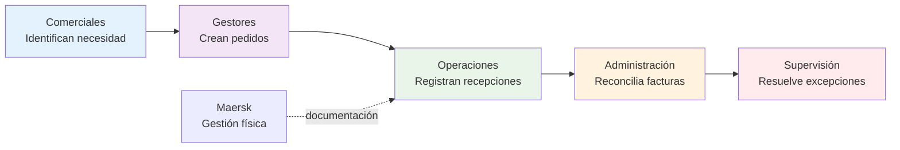
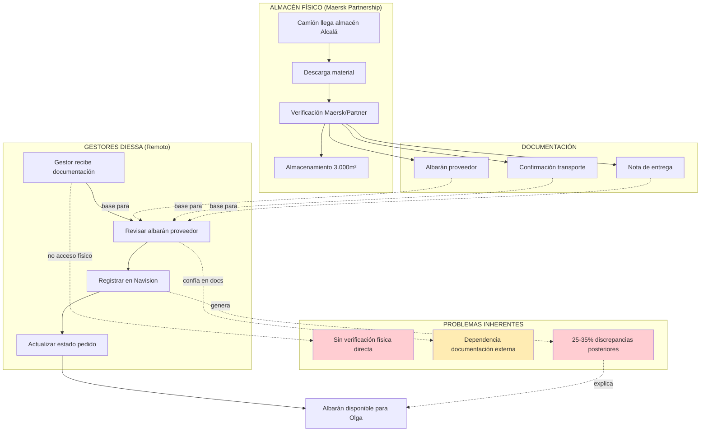
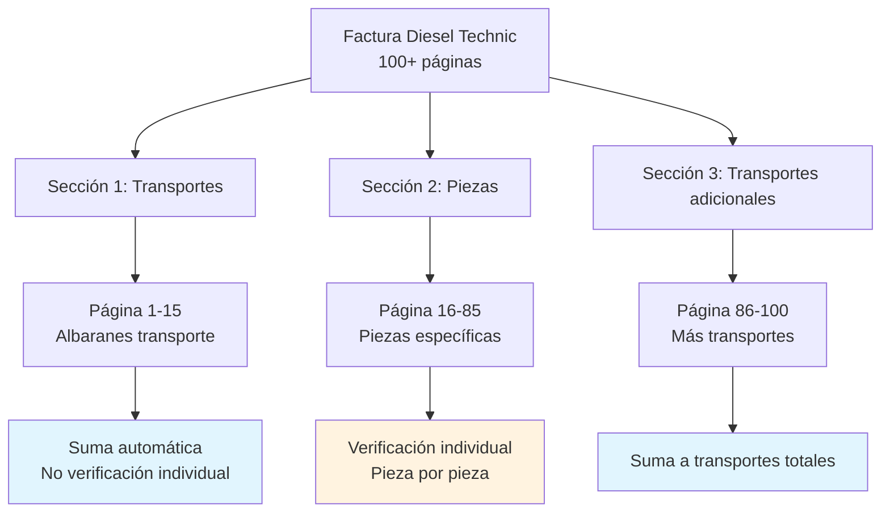
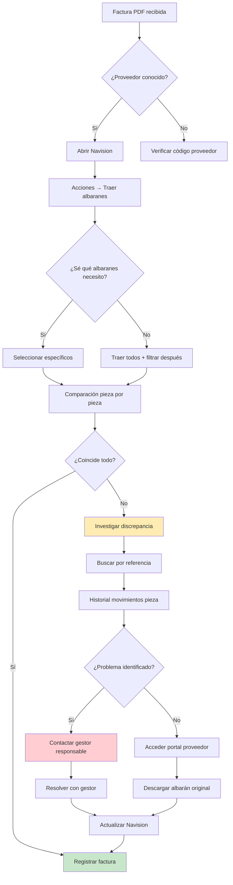
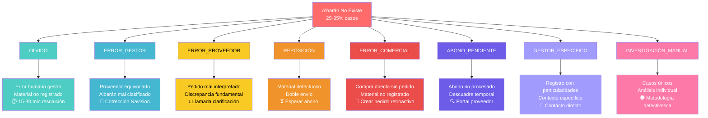
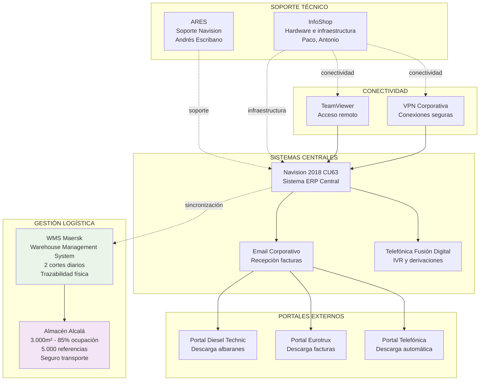

# Cómo Funciona DIESSA: El Ecosistema de Facturas y Albaranes

*Una guía completa para entender los procesos internos de reconciliación documental*

## PARTE I: FUNDAMENTOS CONCEPTUALES

### Capítulo 1: El Mundo de los Recambios de Vehículo Industrial

DIESSA no es una empresa cualquiera. Con 50 años en el sector del vehículo industrial, se ha consolidado como referente en recambios alternativos de calidad equivalente para camiones y autobuses. Esta longevidad no es casual: refleja la complejidad inherente de un negocio donde cada pieza, cada código, cada proveedor forma parte de un ecosistema intrincado que requiere conocimiento especializado.

**Las dimensiones reales de la operación** revelan la escala del desafío: DIESSA gestiona aproximadamente **180.000 piezas anuales** distribuidas en **25-65 contenedores** importados principalmente desde Shanghai y Taipei. El almacén principal en Alcalá de Henares es **gestionado por Maersk**, cuenta con **3.000 metros cuadrados** de superficie y **12-13 metros de altura**, operando al **85% de su capacidad** y albergando cerca de **5.000 referencias diferentes**.

El universo de piezas que maneja DIESSA es extraordinariamente complejo. Un simple "espejo izquierdo" puede tener decenas de variantes según el modelo de camión (Mercedes Actros, Volvo FH, Scania R-Series), el año de fabricación, e incluso el mercado de destino. Esta complejidad se multiplica cuando se considera que DIESSA no fabrica piezas, sino que las obtiene de una red de más de 50 proveedores especializados, procesando **120 pedidos diarios** en promedio con un equipo de **16 trabajadores operando mayoritariamente en remoto**.

**La distinción crítica**: DIESSA opera como intermediario inteligente entre fabricantes/distribuidores y clientes finales. No es un almacén masivo, sino un orquestador logístico que debe conocer exactamente qué proveedor tiene qué pieza, a qué precio, y en qué plazo de entrega. Esta operación se extiende geográficamente: servicio diario a España y Portugal, y operaciones internacionales en Arabia Saudí y Marruecos mediante envíos directos desde fábricas asiáticas.

### Capítulo 2: La Estructura Organizacional Especializada

Para comprender completamente los procesos de facturas y albaranes, es esencial entender cómo se organiza internamente DIESSA y qué responsabilidades tiene cada área funcional.

#### **El Equipo: 16 Profesionales Especializados**

DIESSA opera con un **equipo de 16 trabajadores** distribuidos principalmente en modalidad remota, cada uno con responsabilidades específicas optimizadas para diferentes aspectos del negocio de recambios. Esta especialización no es accidental: refleja la complejidad operativa que requiere conocimiento profundo en múltiples áreas.

#### **División Funcional por Especialización**

**ÁREA ADMINISTRATIVA - El Motor de la Reconciliación:**

La administración de DIESSA está estructurada para manejar eficientemente dos tipos fundamentalmente diferentes de facturas:

- **Responsable de Facturas de Material**: Gestiona exclusivamente facturas de **piezas físicas** (camiones, autobuses). Esta posición requiere reconciliación constante con albaranes registrados en Navision, procesando 180-200 facturas mensuales de 50-60 proveedores especializados.

- **Responsable de Facturas de Servicios**: Maneja facturas de **servicios generales** (mecánicos, servicios externos, gastos operativos). Su proceso es más directo al no requerir verificación contra recepciones físicas.

- **Supervisión Contable**: Gestiona **casos especiales** (combustibles, alquileres, facturas fuera del circuito automático de Navision). Combina supervisión administrativa con actividad comercial activa.

**ÁREA COMERCIAL - Generadores de Demanda:**

El equipo comercial está distribuido geográficamente para optimizar cobertura de mercados:

- **Comercial Zona Norte**: Especialista en mercado español septentrional con décadas de experiencia
- **Comerciales Remotos**: Personal comercial ubicado estratégicamente en mercados internacionales (Marruecos, otros países)
- **Coordinación Internacional**: Gestión de mercados específicos (Reino Unido, Arabia Saudí)

**ÁREA OPERATIVA - Ejecutores del Flujo:**

- **Gestores de Pedidos**: Personal especializado en convertir oportunidades comerciales en operaciones logísticas concretas. Su función incluye: crear ofertas técnicas → convertir ofertas aceptadas en pedidos de venta → generar pedidos de compra correspondientes → registrar albaranes de recepción.

- **Coordinación Logística**: Gestión de la interface con Maersk para operaciones de almacén y distribución.

#### **La Especialización Crítica: Por Tipo de Factura**

La división más importante para entender el procesamiento de facturas es la separación por tipología:

**Facturas CON Trazabilidad Física:**
- Piezas de camiones y autobuses
- Requieren matching obligatorio con albaranes
- Proceso complejo con 25-35% de casos problemáticos
- Gestión mediante Navision con múltiples validaciones

**Facturas SIN Trazabilidad Física:**
- Servicios, gastos operativos, casos especiales
- Registro directo sin verificación de albaranes
- Proceso simplificado de contabilización

#### **Coordinación Interdepartamental Crítica**

El éxito operativo de DIESSA depende de coordinación precisa entre todas las áreas:

**Puntos críticos de coordinación:**

1. **Comercial → Gestor**: La comunicación de ventas debe ser completa y precisa
2. **Gestor → Sistema**: El registro en Navision debe reflejar fielmente las operaciones
3. **Maersk → DIESSA**: La documentación física debe ser precisa y oportuna
4. **Administración → Supervisión**: Las excepciones deben escalarse apropiadamente

#### **Variabilidad Humana en Procesos**

Un aspecto fundamental del funcionamiento de DIESSA es que, siendo una organización de personas, existe variabilidad natural en la ejecución de procesos. Algunos profesionales son extremadamente meticulosos, otros pueden ser más propensos a olvidos. Esta variabilidad humana es una de las razones por las que existen los casos problemáticos que requieren resolución manual especializada.

La experiencia ha demostrado que esta variabilidad se gestiona mejor mediante **sistemas de verificación cruzada** y **coordinación activa** entre áreas, más que intentando eliminarla completamente.

---

### Capítulo 3: La Teoría vs La Realidad Operativa

**En teoría**, un proceso de compras debería ser lineal: necesidad identificada → pedido emitido → material recibido → factura procesada. Esta es la secuencia que enseñan en las escuelas de negocio y que implementan los sistemas ERP estándar.

**En la realidad de DIESSA**, el proceso combina dos estrategias: **inventario estratégico de piezas de alta rotación** más **compras bajo pedido para casos específicos**. Esta hibridación no es casual, sino una optimización para el sector de recambios.

¿Cómo funciona realmente? DIESSA mantiene **5.000 referencias en inventario** (almacén al 85% de capacidad) para las piezas de mayor demanda y rotación predecible. Sin embargo, para piezas específicas, poco comunes, o de alta variabilidad, sigue el modelo "venta primero, compra después". Esta dualidad permite **servicio inmediato** para el 80% de consultas comunes, mientras mantiene **flexibilidad financiera** para el 20% de casos especializados.

Esta realidad operativa genera lo que podríamos llamar "complejidad beneficiosa": cada operación está justificada por una venta real, minimizando el riesgo de inventario obsoleto, pero creando interdependencias entre sistemas de venta y compra que requieren coordinación precisa.

**El desafío de la obsolescencia** es crítico en DIESSA. Con un almacén operando al 85% de capacidad y costos anuales de 60.000 euros, cada decisión de compra debe balancear disponibilidad inmediata contra riesgo de inventario no rotativo. El sector del vehículo industrial es especialmente vulnerable: un modelo de camión descontinuado puede convertir centenares de piezas específicas en inventario obsoleto inmediatamente. DIESSA maneja actualmente un **20% de tasa de error en previsión**, lo que en términos de 180.000 piezas anuales representa un volumen significativo de riesgo financiero.

#### **FAQ: Fundamentos del Negocio**

**P: ¿Por qué DIESSA no mantiene inventario masivo como otros distribuidores?**
R: El negocio de recambios de vehículo industrial tiene tres características que hacen inviable el inventario masivo: (1) Variabilidad extrema de referencias (5.000+ activas), (2) Costo elevado por pieza, y (3) Rotación impredecible dependiente de averías y mantenimientos. El modelo "bajo pedido" minimiza riesgo financiero.

**P: ¿Cómo funciona la gestión logística con Maersk?**
R: Maersk gestiona completamente el almacén de DIESSA en Alcalá de Henares, proporcionando servicios logísticos profesionales. DIESSA mantiene control sobre su inventario específico mientras delega la operativa física a Maersk, optimizando costos operativos.

**P: ¿Qué impacto tiene la gestión internacional en los procesos?**
R: Las operaciones en Arabia Saudí y Marruecos requieren logística diferenciada (envíos directos desde Shanghai) y consideraciones fiscales específicas (certificados EUR1 para reducir aranceles del 22% al 1%). Esto añade complejidad a la gestión de pedidos y facturación.

---

## PARTE II: EL ECOSISTEMA NAVISION DIESSA

### Capítulo 4: El Corazón del Sistema - Navision 2018

Microsoft Dynamics NAV 2018 (específicamente CU63 - Cumulative Update 63) funciona como el sistema nervioso central de DIESSA. Esta versión, aunque no es la más reciente del mercado, fue elegida por su estabilidad y capacidades específicas para el negocio de distribución de recambios.

**¿Por qué Navision y no otro ERP?** La decisión tecnológica de DIESSA refleja las necesidades específicas del sector: gestión compleja de proveedores, trazabilidad de piezas, integración con sistemas de venta, y capacidades robustas para manejo de referencias cruzadas. Navision sobresale en estos aspectos, especialmente en entornos donde las relaciones entre entidades (proveedores, productos, pedidos) son complejas y variables.

El acceso remoto es fundamental en la operativa diaria. DIESSA ha implementado infraestructura que permite trabajo remoto completo, esencial para mantener continuidad en el procesamiento de facturas independientemente de la ubicación física del personal. Esta flexibilidad no es un lujo, sino una necesidad operativa en un equipo mayoritariamente distribuido.

**La arquitectura de acceso** involucra múltiples capas de seguridad y conectividad, gestionadas por proveedores especializados: **ARES** (Andrés Escribano) para aspectos específicos de Navision e **InfoShop** (Paco, Antonio) para infraestructura general y hardware. Esta separación de responsabilidades permite que diferentes tipos de problemas técnicos tengan canales de resolución especializados: errores de Navision van a ARES, problemas de conectividad o hardware van a InfoShop.

### Capítulo 5: La Arquitectura de Códigos DIESSA

El sistema de codificación de DIESSA no es arbitrario; es el resultado de décadas de refinamiento operativo. Cada código cuenta una historia sobre la naturaleza del elemento que representa.

**Proveedores**: Todos siguen el patrón **PR + 6 dígitos**. Como detalla Olga: *"Nuestros proveedores todos empiezan por PR y seis cifras... entonces siempre son PR, cero a cero, ya un número de cuatro, de tres o de dos cifras, con cero si son más cortos"*. Ejemplos: PR001147 (Leo Industrial), PR002415 (Sampa), PR001359 (NRF España).

**Productos**: La clasificación por primera letra no es casual:
- **Códigos C**: Productos "no originales" - recambios alternativos de calidad equivalente
- **Códigos K**: Productos "originales" - piezas de fabricante original
- **Códigos M**: Productos "marca" - piezas de marca reconocida

Esta clasificación permite identificación inmediata del tipo de producto y su tratamiento en el sistema, afectando precios, garantías, y estrategias de venta.

**Documentos**: Cada tipo de documento tiene su prefijo distintivo:
- **PC**: Pedidos de Compra
- **ALBC**: Albaranes de Compra  
- **FA**: Facturas

---

## PARTE III: EL FLUJO VITAL - DE LA NECESIDAD A LA FACTURA

### Capítulo 6: El Génesis - Cuando un Cliente Necesita una Pieza

Todo comienza con una llamada telefónica. Un transportista en carretera, un mecánico en taller, un gestor de flota. La necesidad es inmediata: "Necesito un espejo izquierdo para un Mercedes Actros 2019". Esta simplicidad aparente esconde una complejidad técnica considerable.

El comercial que recibe la llamada debe convertir una descripción a menudo imprecisa en un código específico del catálogo DIESSA. DIESSA cuenta con múltiples comerciales especializados, algunos trabajando remotamente desde ubicaciones estratégicas (Marruecos, otros países). Este proceso requiere conocimiento técnico especializado: ¿qué variante exacta del espejo? ¿con o sin calefacción? ¿lado conductor o acompañante? ¿para qué configuración específica del Actros?

**El momento crítico** es la identificación precisa de la pieza. Un error aquí se propaga a través de todo el sistema: pedido incorrecto → material equivocado → cliente insatisfecho → devolución → pérdida económica y de tiempo.

Una vez identificada la pieza, el comercial debe verificar disponibilidad, consultando internamente o contactando proveedores. Este paso es crucial porque determina el precio final y el plazo de entrega que se ofrecerá al cliente.

### Capítulo 7: El Nacimiento del Pedido

Aquí reside una de las peculiaridades más importantes del sistema DIESSA: **para crear un pedido de compra, primero debe existir un pedido de venta**.

Como explica Olga: *"Para crear un pedido de compra, primero tienen que hacer la venta, es decir, primero tienen que generar el pedido de venta para poder hacer el pedido de compra"*. Esta secuencia, que puede parecer burocrática, tiene una lógica de negocio sólida: garantiza que cada compra está respaldada por una venta confirmada.

**¿Qué puede salir mal?** En la urgencia de servir al cliente, los comerciales pueden contactar directamente al proveedor solicitando material sin crear el pedido de venta correspondiente en el sistema. Esto genera lo que se conoce como "error del proceso comercial": material pedido, enviado, y recibido, pero sin existir registrado en Navision.

**La gestión de compras directas**: Cuando surge una compra directa, DIESSA maneja dos tipos de operaciones: (1) **Proveedores locales**: Para necesidades urgentes, donde el comercial actúa como intermediario directo, y (2) **Distribuidores**: Para productos específicos, donde el proceso es más simple pero requiere coordinación posterior con el sistema.

### Capítulo 8: La Gestión de Pedidos de Compra

Los gestores son los arquitectos operativos del sistema DIESSA. Su función va más allá de la mera captura de datos: deben traducir necesidades comerciales en especificaciones técnicas precisas dentro de Navision.

**El proceso del gestor** comienza con el pedido de venta confirmado. Debe entonces:
1. **Identificar el proveedor óptimo** para la pieza específica
2. **Calcular el precio de compra** considerando márgenes objetivo
3. **Crear el pedido de compra** en Navision con especificaciones exactas
4. **Transmitir el pedido al proveedor** por el canal apropiado

**La fórmula de precios** sigue una lógica aproximada de "precio de compra + 18% = precio de venta", aunque esta es una simplificación. Los gestores deben considerar factores como competencia, urgencia del cliente, relación comercial, y volúmenes de compra.

---

## PARTE IV: LA RECEPCIÓN FÍSICA Y DIGITAL

### Capítulo 9: Cuando Llega el Material

La recepción de material en DIESSA ilustra perfectamente la dualidad entre mundo físico y mundo digital que caracteriza el negocio moderno de distribución.

**En el mundo físico**: Los camiones llegan al almacén de DIESSA en Alcalá de Henares, gestionado operativamente por Maersk, donde se descargan las piezas y se almacenan. DIESSA delega la gestión física del almacén a Maersk, lo que significa que la operativa logística está externalizada a un proveedor especializado.

**En el mundo digital**: Los gestores de DIESSA trabajan remotamente y deben registrar las recepciones en Navision basándose en la documentación de entrega (albaranes del proveedor, confirmaciones de recepción). Esta separación entre operación física y registro digital crea una dependencia en la documentación precisa.

**La sincronización crítica** entre estos dos mundos presenta un desafío estructural: los gestores deben registrar en Navision lo que ha sido físicamente recibido sin verificación directa personal. Esto explica en parte por qué surgen discrepancias entre lo registrado digitalmente y lo que Olga encuentra en las facturas de proveedores.

#### **FAQ: Operativa Física del Almacén**

**P: ¿Quién verifica físicamente las recepciones en el almacén?**
R: **Maersk gestiona completamente la operativa física** del almacén de DIESSA en Alcalá de Henares. La verificación física de recepciones la realiza el personal de Maersk siguiendo procedimientos del sistema WMS, no el personal de DIESSA.

**P: ¿Cómo registran los gestores si no verifican físicamente?**
R: Basándose en documentación de entrega (albaranes del proveedor, confirmaciones de transporte). Esta dependencia en documentación externa explica parte de las discrepancias que Olga debe resolver posteriormente.

**P: ¿Es esta separación física/digital una fuente de problemas?**
R: Sí. La falta de verificación física directa por parte de los gestores que registran en Navision contribuye a las discrepancias que representan el 25-35% de casos problemáticos que maneja Olga.

#### **Diagrama: Flujo Físico vs Digital**

#### **FAQ: Recepción y Registro**

**P: ¿Qué ocurre si el material físico no coincide exactamente con el pedido?**
R: Los gestores deben registrar lo realmente recibido, no lo pedido. Navision permite registrar cantidades parciales, pero requiere que se documente la discrepancia para seguimiento posterior.

**P: ¿Cómo funciona el sistema WMS con Maersk?**
R: Maersk proporciona un **Warehouse Management System (WMS)** profesional con **dos cortes diarios** para envío de pedidos. DIESSA paga por espacio ocupado (85% de 3.000m²), lo que incentiva rotación eficiente y gestión precisa de obsolescencia. El sistema incluye seguro de transporte y KPIs enfocados en la entrega.

### Capítulo 10: Gestión de Albaranes de Compra

Los albaranes en DIESSA tienen una complejidad que va más allá de la mera confirmación de recepción. Son documentos que deben servir múltiples propósitos: confirmación física, registro contable, base para facturación, y trazabilidad completa.

**Teoría vs Realidad**: En teoría, cada entrega debería generar un albarán único y completo. En la realidad de DIESSA, especialmente con proveedores como Diesel Technic, un solo envío puede generar albaranes múltiples, parciales, y con estructuras complejas.

El caso Diesel Technic es paradigmático. Como describe Olga: *"En el diesel técnico normalmente son 15 días y son ya te digo que 115 hojas más o menos de factura, suelen ir todas"*. Estas facturas contienen dos tipos de albaranes completamente diferentes:

1. **Albaranes de transporte**: Cargos por el envío físico del material
2. **Albaranes de piezas**: Las piezas específicas enviadas

*"Los transportes van totalmente desligados de las piezas, aunque luego el albarán es el mismo"*, explica Olga. Esta separación conceptual requiere que el sistema trate cada tipo de forma diferente, sumando todos los transportes como una partida única, pero validando cada pieza individualmente.

#### **Diagrama: Estructura Factura Diesel Technic**

#### **FAQ: Gestión de Albaranes**

**P: ¿Por qué Diesel Technic separa transportes y piezas en la misma factura?**
R: Es una práctica específica de este proveedor para facilitar la contabilización separada de costos logísticos vs costos de material. DIESSA debe adaptar su proceso de reconciliación a esta estructura particular.

**P: ¿Cómo identifica Olga si un albarán es de transporte o de pieza?**
R: Visualmente en la factura PDF: *"esta primera hoja siempre está la primera hoja con su cabecera... y ves que me pone el albarán y aquí transporte"*. Los albaranes de piezas no incluyen la palabra "transporte".

### Capítulo 11: El Registro en Navision

El registro de albaranes en Navision es donde la operación de DIESSA se encuentra con la rigidez de los sistemas ERP. Navision exige precisión: campos obligatorios completados, relaciones entre entidades correctas, cantidades que cuadren matemáticamente.

**Los gestores** enfrentan el desafío diario de traducir la variabilidad del mundo real a la estructura fija de Navision. Deben registrar no solo lo que llegó, sino cómo llegó, cuándo llegó, y en qué condiciones. Cada albarán registrado actualiza automáticamente los pedidos de compra correspondientes, modificando las cantidades "recibidas" y "pendientes de facturación".

**El momento crítico** es marcar el albarán como "recibido". Una vez marcado, entra en el universo de documentos que Olga debe reconciliar con las facturas de proveedores. Si el registro es impreciso o incompleto, el proceso de reconciliación se complica exponencialmente.

---

## PARTE V: PROCESO DE RECONCILIACIÓN DE FACTURAS

### Capítulo 12: Operativa de Reconciliación de Facturas

La función de reconciliación de facturas constituye un proceso crítico donde convergen múltiples flujos de información de DIESSA. El responsable de esta función gestiona: *"una media, unas 180, unas 200 facturas al mes de unos 50 proveedores"*, requiriendo coordinación constante entre sistemas internos y documentación externa.

**La división del trabajo** es clara y funcional: Olga se encarga exclusivamente de *"proveedores que nos facturan piezas de los camiones, o de los autobuses"*, mientras que su compañera Gloria maneja servicios generales. Fernando López, como supervisor de contabilidad, gestiona **facturas de acreedores** (no de proveedores de material) y **gastos generales**. Esta separación evita interferencias: *"Olga de Internacional no toca nada, igual que yo de Nacional no toco nada. Yo no genero, o sea, perdón, no toco compras de material"*, confirma Fernando.

**El setup tecnológico** de Olga refleja las necesidades de su trabajo: acceso remoto a Navision, múltiples pantallas para comparar documentos, acceso a portales de proveedores, y conectividad telefónica para coordinación con gestores. Como profesora de informática de formación, Olga ha optimizado su entorno de trabajo para maximizar eficiencia en tareas repetitivas.

**La presión temporal** es constante. Especialmente cuando DIESSA era "contribuyente especial": *"para contribuyentes especiales solo tienes cuatro días para declarar las facturas"*. Aunque esta condición ya no aplica, el ritmo de trabajo permanece intenso por el volumen constante de facturas.

### Capítulo 13: La Recepción de Facturas

Las facturas llegan a DIESSA por múltiples canales, cada uno con sus propias características y desafíos:

**Canal principal - Email (95%)**: La mayoría de proveedores envían facturas por correo electrónico. Olga gestiona una bandeja de entrada especializada donde los PDFs se acumulan diariamente. *"Me la envían por email, siempre, sí"*, confirma Olga.

**Portales web especializados**: Proveedores como Diesel Technic y Eurotrux han implementado portales donde las facturas se descargan manualmente. Estos sistemas, aunque requieren pasos adicionales, proporcionan mayor control sobre el momento de descarga y acceso a documentación auxiliar como albaranes de entrega.

**Calendarios automáticos**: Ciertos proveedores tienen patrones predecibles. Telefónica, por ejemplo, factura sistemáticamente los días 1 y 19 de cada mes. Esta predictibilidad permite a Olga organizar su agenda sabiendo cuándo esperar ciertas facturas. *"Ahí ya sé yo que los 1 y los 19 siempre hay una factura de Telefónica"*, confirma Olga.

**El sistema de telefonía corporativo**: DIESSA utiliza **Telefónica Fusión Digital** con IVR (Interactive Voice Response) y sistema de extensiones. Olga gestiona las extensiones de los operadores y puede reorganizar el orden de derivación de llamadas según disponibilidad del personal. Cuando los gestores no contestan, las llamadas saltan automáticamente a contabilidad, donde Olga las deriva de vuelta o proporciona números directos.

**El procesamiento inmediato** es crítico. Como señala Olga sobre Telefónica: *"como te las pasan al banco pues el mismo día hoy pues en un par de días me dice mi jefe hoy yo tengo esto pendiente en el banco"*. Los proveedores que cobran por domiciliación bancaria requieren procesamiento inmediato para evitar descoordinaciones financieras.

### Capítulo 14: Proceso de Matching Manual

El matching que realiza Olga diariamente es una operación cognitiva compleja que combina lógica sistemática con intuición desarrollada por años de experiencia.

**Paso 1 - Apertura dual**: Olga trabaja con dos ventanas simultáneamente: la factura PDF del proveedor en una pantalla, Navision con los albaranes registrados en otra. Esta configuración permite comparación visual directa, fundamental para identificar correspondencias.

**Paso 2 - Búsqueda inteligente**: En Navision, Olga accede a "Acciones → Traer albaranes de compra", que presenta todos los albaranes disponibles del proveedor. Aquí aplica su primera regla de eficiencia: *"si sabemos cuáles, o yo no lo sé, me traigo todos y voy mirando, luego lo que necesito"*.

**Paso 3 - Comparación meticulosa**: El proceso de comparación es donde la experiencia de Olga se vuelve irreemplazable. Busca correspondencias entre:
- Números de referencia del proveedor vs códigos internos DIESSA
- Cantidades facturadas vs cantidades recibidas
- Precios unitarios vs precios de pedido
- Fechas de albarán vs fechas de factura

**Paso 4 - Resolución de discrepancias**: Cuando algo no cuadra, Olga emplea una metodología estructurada: *"lo miro por el número de referencia, pero me voy para atrás"*. Utiliza las capacidades de Navision para rastrear movimientos de piezas, verificar historial de precios, y identificar patrones que expliquen las diferencias.

#### **Diagrama: Metodología de Matching de Olga**

#### **FAQ: Proceso de Matching**

**P: ¿Por qué Olga trae "todos" los albaranes en lugar de buscar específicos?**
R: Como explica Olga: *"si sabemos cuáles, o yo no lo sé, me traigo todos y voy mirando"*. Esta estrategia refleja que frecuentemente la información en las facturas es incompleta o ambigua, haciendo más eficiente traer todo y filtrar visualmente.

**P: ¿Qué hace Olga cuando encuentra diferencias de precio menores?**
R: Aplica criterio de materialidad: *"si son, pues como antes te decía, unos son 20 y otros son 22, por 2 euros no ni les molesto"*. Diferencias menores se aceptan, diferencias significativas requieren investigación.

**P: ¿Cómo maneja Olga facturas de 100+ páginas como Diesel Technic?**
R: Utiliza una estrategia de impresión: *"Yo cuando son tanto sí que me lo saco porque soy incapaz"*. Imprime la factura para poder trabajar con papel físico paralelamente a Navision en pantalla.

## PARTE VI: ANÁLISIS DE PROBLEMAS OPERATIVOS

### Capítulo 15: Variabilidad de Formatos de Proveedores

El número 196 no es aleatorio. Representa las variaciones de formato identificadas en un solo proveedor durante el análisis profundo del proceso de reconciliación. Esta cifra ilustra la magnitud del desafío que enfrenta DIESSA diariamente: cada proveedor tiene su propio "dialecto" para comunicar información esencial.

**¿Por qué cada proveedor es diferente?** La respuesta radica en la evolución independiente de los sistemas de gestión. Cada proveedor ha desarrollado su propio formato de facturación basado en sus necesidades internas, software utilizado, y tradiciones operativas. Diesel Technic estructura sus facturas de una manera, Leo Industrial de otra, Sampa de una tercera. Para DIESSA, esto significa que no existe un "formato estándar" que procesar.

**La babel de referencias**: Un mismo producto puede tener múltiples identificadores según el proveedor. Una pieza que DIESSA codifica como "C001234" puede aparecer en facturas como "REF-ABC-123" (Proveedor A), "XYZ-789-2025" (Proveedor B), o simplemente "789" (Proveedor C). Esta multiplicidad requiere que DIESSA mantenga tablas de referencias cruzadas para cada proveedor, información que está almacenada en los endpoints ODATA_RefCruz_Productos.

**El problema de las fechas**: Los formatos de fecha varían enormemente: dd/mm/yyyy, dd-mm-yyyy, mm/dd/yyyy, o incluso formatos textuales como "22 de mayo de 2025". Para un sistema automatizado, esta variabilidad representa múltiples algoritmos de parsing y validación.

### Capítulo 16: Escenarios de Excepciones Operativas

En el PowerPoint explicativo que Olga preparó, identifica ocho escenarios donde un albarán puede "no existir" en el sistema, a pesar de que la factura lo referencie. Estos casos representan el 25-35% de todas las facturas procesadas, convirtiendo la gestión de excepciones en una competencia crítica.

**ESCENARIO 1 - OLVIDO**: El más humano de los errores. El gestor recibe físicamente el material, pero olvida registrar el albarán en Navision. *"El gestor le ha llegado el albarán y se le ha olvidado darlo de entrada"*. La resolución requiere contactar al gestor responsable, identificar el material pendiente, y crear el albarán retroactivamente.

**ESCENARIO 2 - ERROR DEL GESTOR**: Confusión en la asignación de proveedor. El material está registrado en el sistema, pero asignado al proveedor incorrecto (por ejemplo, registrado bajo Eurotrux cuando debería estar bajo Diesel Technic). La resolución requiere corrección en el sistema y reasignación al proveedor correcto.

**ESCENARIO 3 - ERROR DEL PROVEEDOR**: El proveedor registra incorrectamente el pedido inicial. Esto genera discrepancias fundamentales entre lo pedido, lo enviado, y lo facturado. La resolución requiere comunicación directa con el proveedor para clarificar la situación real.

**ESCENARIO 4 - REPOSICIÓN**: Un caso especialmente complejo. El material inicial llegó defectuoso y fue devuelto. El proveedor envía reposición, pero el sistema aún refleja la primera entrega. Como explica Olga: *"Al mandarla dos veces, yo al cliente no se la cobro dos veces. El proveedor sí me la cobra dos veces"*. La resolución requiere esperar al abono correspondiente para balancear las cuentas.

**ESCENARIO 5 - ERROR COMERCIAL**: Los comerciales compran directamente sin crear pedido en sistema. En la urgencia de servicio al cliente, pueden contactar directamente al proveedor olvidando informar al gestor para registro en sistema. Material recibido y enviado al cliente, pero sin registro en Navision.

**ESCENARIO 6 - ABONO PENDIENTE**: Material fue abonado por el proveedor pero el abono no ha llegado o no se ha procesado. Requiere búsqueda en portal del proveedor o coordinación con Fernando (quien recibe los abonos de Diesel Technic).

**ESCENARIO 7 - GESTOR ESPECÍFICO**: El albarán fue registrado por un gestor específico con particularidades en el proceso. Requiere comunicación directa con el gestor responsable para obtener contexto adicional sobre las circunstancias del registro.

**ESCENARIO 8 - INVESTIGACIÓN MANUAL**: Casos que no encajan en categorías anteriores y requieren análisis caso por caso.

#### **Diagrama: Los 8 Escenarios de Albarán Faltante**

#### **FAQ: Gestión de Excepciones**

**P: ¿Cuánto tiempo invierte Olga en resolver cada tipo de excepción?**
R: Varía significativamente: olvidos del gestor (15-30 min), errores de proveedor (30-60 min), reposiciones (1-3 días esperando abono). Los gestores responden en menos de 30 minutos normalmente.

**P: ¿Por qué algunos comerciales compran directamente sin crear pedidos?**
R: Por urgencia del cliente. La presión de servicio inmediato en el sector del transporte a veces requiere acciones directas que pueden saltarse temporalmente los procesos formales de registro en sistema.

**P: ¿Cómo se previenen estos escenarios?**
R: La experiencia ha demostrado que son inherentes al negocio. La estrategia es optimizar la resolución más que la prevención, manteniendo canales de comunicación eficientes entre Olga, gestores, y comerciales.

### Capítulo 17: La Gestión de Excepciones

Cuando Olga enfrenta un albarán faltante, despliega una metodología estructurada que refleja años de experiencia resolviendo casos complejos.

**Fase 1 - Verificación interna**: Utiliza las capacidades de búsqueda de Navision para verificar si el albarán existe bajo diferentes criterios: por proveedor, por pieza, por fecha, por gestor responsable. *"lo miro por el número de referencia, pero me voy para atrás... botón derecho, busco la pieza y me da un informe de todos los movimientos de la pieza"*.

**Fase 2 - Consulta externa**: Si el albarán no existe internamente, accede a los portales de proveedores. Para Diesel Technic: *"me irme a la página de es el técnic... yo tengo un usuario y una contraseña... me descargo el albalán que me deja descargarlo sin ningún problema"*. Esta capacidad de verificación externa es crítica para determinar si el problema es interno (no registrado) o externo (no enviado).

**Fase 3 - Coordinación humana**: La resolución final a menudo requiere comunicación directa. Olga contacta al gestor responsable: *"pues yo sabría que el gestor ha hecho esta albarán... es Paco López yo me pongo contacto con Paco le mando esta albarán y le digo y mira Paco que este no está"*. Esta coordinación humana es donde la experiencia y las relaciones interpersonales se vuelven críticas.

---

## PARTE VII: LA COMPLEJIDAD ESPECÍFICA POR PROVEEDOR

### Capítulo 18: Caso de Estudio: Diesel Technic

Diesel Technic representa el paradigma de la complejidad gestionada. Es simultáneamente el proveedor más desafiante y el más confiable, una paradoja que Olga resume perfectamente: *"es el proveedor más horroroso a el de que tiene muchísimos albaranes pero también es verdad que es el mejor porque todo está bastante bien cuadrado"*.

**Las dimensiones del desafío**: Facturas de 100+ páginas cada 15 días. Para contextualizar: en un año, Diesel Technic genera aproximadamente 2.600 páginas de facturas que Olga debe procesar. Cada página puede contener múltiples líneas de productos, cada una requiriendo verificación individual.

**La división conceptual**: Diesel Technic separa sistemáticamente albaranes de transporte y albaranes de piezas. *"esta primera hoja siempre está la primera hoja con su cabecera... y ves que me pone el albarán y aquí transporte... Aquí no es la primera hoja en esta de la derecha, sino que es un albarán de una pieza"*. Esta separación requiere que Olga aplique estrategias diferentes:

- **Transportes**: Suma automática de todos los cargos de envío
- **Piezas**: Verificación individual pieza por pieza

**La ventaja del portal web**: Cuando surgen discrepancias, Diesel Technic proporciona acceso a un portal donde Olga puede descargar albaranes específicos para verificación. Esta capacidad de auditoría externa convierte problemas potencialmente irresolubles en investigaciones estructuradas.

### Capítulo 19: Otros Proveedores Principales

**Leo Industrial (PR001147)** representa el equilibrio entre volumen y simplicidad. Como segundo proveedor en importancia, sus facturas siguen patrones más predecibles, pero aún requieren atención detallada. Olga procesa aproximadamente 24 facturas anuales de Leo, cada una con complejidad moderada.

**Sampa (PR002415)** ha implementado una práctica que Olga valora especialmente: *"sampa me manda todos los albaranes que van ejecutando y me los mandan por correo"*. Esta proactividad en el envío de documentación auxiliar reduce significativamente el tiempo de reconciliación.

**Los 45+ proveedores restantes** representan la "cola larga" de la operación DIESSA. Individualmente pueden parecer menores, pero colectivamente suman volumen significativo y cada uno aporta sus propias peculiaridades al proceso.

---

## PARTE VIII: ARQUITECTURA DE DATOS EN NAVISION

### Capítulo 20: Las Entidades Fundamentales

Navision organiza la operación DIESSA en cuatro entidades fundamentales, cada una con su función específica y relaciones definidas:

**Pedidos de Compra**: Representan la intención formal de adquirir material. Contienen especificaciones exactas: qué pieza, qué cantidad, a qué precio, de qué proveedor. Una vez creado, el pedido funciona como contrato interno que guía todas las operaciones posteriores.

**Albaranes de Compra**: Documentan la recepción física del material. Actualizan los pedidos con cantidades realmente recibidas, fechas de entrada, y condiciones de recepción. Un albarán puede ser parcial (parte del pedido) o múltiple (varios albaranes para un pedido).

**Borradores de Factura**: Preparan el pago al proveedor basándose en albaranes recibidos. Permiten revisión y aprobación antes del registro final. Aquí es donde Olga realiza su trabajo de reconciliación, vinculando facturas recibidas con albaranes registrados.

**Facturas Registradas**: El estado final, donde la obligación de pago se formaliza contablemente. Una vez registrada, la factura no puede modificarse, solo corregirse mediante abonos o documentos de ajuste.

### Capítulo 21: Las Relaciones Vitales

Las entidades de Navision no existen aisladamente; están conectadas por relaciones que reflejan el flujo real del negocio:

**Pedido → Albarán**: Un pedido puede generar múltiples albaranes (entregas parciales), pero cada albarán debe trazar su origen a un pedido específico. Esta relación permite rastrear el cumplimiento gradual de compromisos de compra.

**Albarán → Factura**: Los albaranes se agrupan en facturas, pero no necesariamente en relación 1:1. Una factura puede incluir múltiples albaranes, y un albarán puede dividirse entre múltiples facturas (facturación parcial).

**Las cantidades en movimiento**: Navision rastrea tres estados para cada línea de pedido:
- **Cantidad pedida**: Lo inicialmente solicitado
- **Cantidad recibida**: Lo realmente entregado (suma de albaranes)
- **Cantidad facturada**: Lo ya facturado por el proveedor

Esta trazabilidad triple permite identificar discrepancias en cualquier punto del proceso.

---

## PARTE IX: OPERACIONES DIARIAS

### Capítulo 22: Flujo Operativo Diario

La jornada de Olga sigue un ritmo estructurado que refleja tanto las necesidades internas de DIESSA como las exigencias externas de proveedores y regulaciones.

**8:00 AM - Apertura y diagnóstico**: La jornada comienza revisando emails recibidos durante la noche. Facturas de proveedores europeos que operan en diferentes husos horarios, notificaciones automáticas de portales web, comunicaciones urgentes de gestores sobre problemas específicos.

**9:00 AM - Procesamiento sistemático**: Apertura de Navision y inicio del matching. Olga prioriza basándose en urgencia: facturas con domiciliación bancaria inmediata (Telefónica), facturas de alto volumen (Diesel Technic), y casos con problemas identificados previamente.

**11:00 AM - Coordinación interna**: Primera ronda de comunicaciones con gestores para resolver discrepancias identificadas durante el matching matinal. Como señala Olga: *"se lo mando hacer a cualquiera de ellos y me tardan lo que puedan... Si tienen siete llamadas seguidas, pues de verdad que mejor no van a hacer caso, pero más de media hora no suelen tardar en arreglármelo"*.

**14:00 PM - Resolución de casos complejos**: Los casos que no se resolvieron en la mañana requieren investigación más profunda. Acceso a portales de proveedores, búsquedas históricas en Navision, coordinación con comerciales para casos de "error comercial".

**17:00 PM - Cierre y preparación**: Finalización de facturas completadas, identificación de casos pendientes para el día siguiente, comunicación de problemas irresueltos que requieren atención especial.

### Capítulo 23: Ciclos y Patrones Operativos

DIESSA opera bajo múltiples ciclos temporales superpuestos que Olga debe coordinar simultáneamente:

**Ciclos diarios**: Telefónica factura los días 1 y 19 de cada mes con precisión automática. *"Ahí ya sé yo que los 1 y los 19 siempre hay una factura de Telefónica"*. Esta predictibilidad permite planificación, pero también crea ventanas críticas donde el procesamiento no puede demorarse.

**Ciclos quincenales**: Diesel Technic envía facturas cada 15 días con volumen masivo. Esta regularidad aparente esconde complejidad interna: 100+ páginas que requieren procesamiento meticuloso en ventanas de tiempo limitadas.

**Ciclos mensuales**: El cierre contable de DIESSA requiere que todas las facturas del mes estén procesadas y reconciliadas. Esto crea presión creciente hacia fin de mes, especialmente si existen casos problemáticos acumulados.

**Eventos irregulares**: Abonos, devoluciones, correcciones de facturas anteriores. Estos eventos "fuera de ciclo" interrumpen el flujo normal y requieren atención especializada inmediata.

---

## PARTE X: PRINCIPIOS OPERATIVOS

### Capítulo 24: Principios Operativos Fundamentales

La operación de DIESSA funciona bajo principios que nunca han sido formalizados en manuales, pero que guían cada decisión diaria:

**"Todo se puede resolver"**: Esta mentalidad, encarnada por Olga, refleja la realidad de que en el negocio de recambios, cada problema no resuelto significa un cliente sin servicio. *"Bueno, esto te he dicho que es el proveedor más organizado y quizás es el más fácil de hacer porque todo es más sencillo de localizar"*. Incluso los proveedores más complejos son "resolubles" con la metodología adecuada.

**"Los gestores responden rápidamente"**: La cultura de colaboración interna es fundamental. *"Los chicos son muy rápidos de respuesta... más de media hora no suelen tardar en arreglármelo"*. Esta responsividad no es accidental; es el resultado de entender que el tiempo de resolución de Olga afecta directamente la satisfacción del cliente final.

**"Cuando hay dudas, se pregunta"**: La comunicación directa supera a la especulación. Olga no duda en contactar directamente a gestores, comerciales, o incluso proveedores cuando la información es ambigua. Esta filosofía previene errores que serían costosos de corregir posteriormente.

**"El cliente no puede esperar"**: La presión temporal en DIESSA no es artificial; refleja la realidad del sector del transporte donde un camión parado representa pérdidas económicas inmediatas para el cliente.

### Capítulo 25: Tensiones Operativas y Equilibrios

La operación diaria de DIESSA está caracterizada por tensiones constantes que requieren equilibrio dinámico:

**Precisión vs Velocidad**: Cada factura requiere verificación meticulosa, pero el volumen (180-200 mensuales) exige eficiencia. Olga ha desarrollado heurísticas que le permiten identificar rápidamente qué facturas requieren atención especial y cuáles pueden procesarse de forma estándar.

**Manual vs Automático**: Aunque Navision automatiza muchos procesos (cálculo de fechas de vencimiento, actualización de cantidades), el matching fundamental sigue siendo manual porque requiere juicio humano para interpretar variaciones de formato.

**Individual vs Colaborativo**: Olga es responsable individual del procesamiento de facturas, pero el éxito depende de coordinación constante con gestores, comerciales, y proveedores. Esta tensión entre autonomía y dependencia requiere habilidades tanto técnicas como interpersonales.

**Presente vs Futuro**: Los procesos actuales funcionan, pero enfrentan presiones crecientes: volumen en aumento, regulaciones cambiantes (SII), expectativas de eficiencia. La resistencia natural al cambio debe balancearse con la necesidad de evolución.

---

## CONCLUSIONES: ANÁLISIS OPERATIVO DE DIESSA

### Competencias Clave de Reconciliación

El proceso que ejecuta Olga diariamente representa mucho más que reconciliación contable. Es la manifestación de décadas de conocimiento acumulado sobre cómo funciona realmente el negocio de recambios de vehículo industrial.

**El conocimiento tácito**: Gran parte de la competencia de Olga no está documentada en ningún manual. Es el resultado de experiencia práctica: saber qué proveedores son más propensos a errores, qué tipos de discrepancias son normales vs problemáticas, cuándo vale la pena investigar una diferencia de precio y cuándo aceptarla.

**La eficiencia oculta**: Aunque el proceso puede parecer manual e ineficiente desde una perspectiva externa, está altamente optimizado para las realidades específicas de DIESSA. Cada "ineficiencia aparente" (como traer todos los albaranes para después filtrar) refleja una optimización para casos reales donde la información inicial es incompleta o ambigua.

**El valor de la experiencia humana**: En un mundo que tiende hacia la automatización total, el caso de DIESSA ilustra por qué ciertos procesos siguen requiriendo juicio humano. Las 196 variaciones de formato, los 8 escenarios de excepción, y las relaciones complejas con proveedores representan un nivel de variabilidad que desafía la sistematización simple.

### ¿Por Qué Funciona Así?

La aparente complejidad del sistema DIESSA no es accidental ni ineficiente. Es el resultado de adaptación inteligente a las realidades de un sector específico:

1. **El modelo "vender antes de comprar"** minimiza riesgo financiero en un negocio de alta variabilidad
2. **La gestión manual de excepciones** proporciona flexibilidad que sistemas rígidos no pueden ofrecer
3. **Las relaciones humanas con proveedores** permiten resolución de problemas que contractos formales no contemplan
4. **El conocimiento especializado** se acumula en personas que entienden tanto el negocio como la tecnología

DIESSA funciona como funciona porque esta configuración específica ha demostrado ser efectiva para sus necesidades particulares. Cualquier cambio debe respetar estas realidades operativas o arriesga disrumpir un sistema que, aunque complejo, es fundamentalmente funcional.

#### **Diagrama: Ecosistema Tecnológico DIESSA**

#### **FAQ: Tecnología y Herramientas**

**P: ¿Por qué DIESSA mantiene Navision 2018 en lugar de actualizar?**
R: Navision 2018 CU63 proporciona estabilidad probada para las operaciones críticas de DIESSA. Las actualizaciones de ERP en empresas de distribución requieren migración de datos complejos y reentrenamiento extensivo, riesgos que deben balancearse contra beneficios funcionales.

**P: ¿Cómo maneja Olga el trabajo remoto con sistemas tan complejos?**
R: Mediante acceso remoto seguro y configuración multi-pantalla optimizada. Como ex-profesora de informática, Olga ha personalizado su entorno para maximizar eficiencia en tareas de comparación intensiva.

**P: ¿Qué ocurre cuando fallan las conexiones o sistemas?**
R: DIESSA mantiene múltiples proveedores de soporte: ARES para Navision, InfoShop para infraestructura general. La separación de responsabilidades asegura que diferentes tipos de problemas técnicos tengan canales de resolución especializados.

### **Resumen Ejecutivo: Modelo Operativo DIESSA**

El sistema DIESSA representa un ejemplo paradigmático de cómo las realidades sectoriales específicas moldean procesos operativos que, aunque pueden parecer complejos desde perspectivas externas, están altamente optimizados para sus contextos particulares.

**Los números clave** que definen la operación:
- **180.000 piezas/año** procesadas
- **120 pedidos/día** gestionados
- **180-200 facturas/mes** reconciliadas por Olga
- **25-35% tasa de excepciones** gestionadas exitosamente
- **85% ocupación** de almacén optimizada para rotación

**La filosofía subyacente** es pragmática: cada proceso existe porque resuelve un problema real del negocio de recambios. La complejidad no es accidental, sino el resultado de décadas de refinamiento operativo para maximizar servicio al cliente mientras se minimizan riesgos financieros.

---

*Este documento está basado en transcripciones de reuniones (19 marzo 2025 - Olga Manzano, 25 marzo 2025 - Equipo directivo), análisis de emails operativos, documentación técnica de ARES, y PowerPoint explicativo de procesos internos preparado por Olga Manzano. Las citas directas permiten entender no solo qué hace DIESSA, sino por qué lo hace de esa manera específica.*