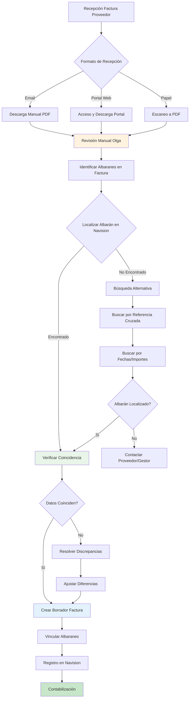
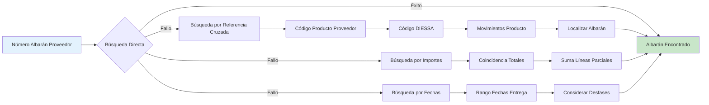
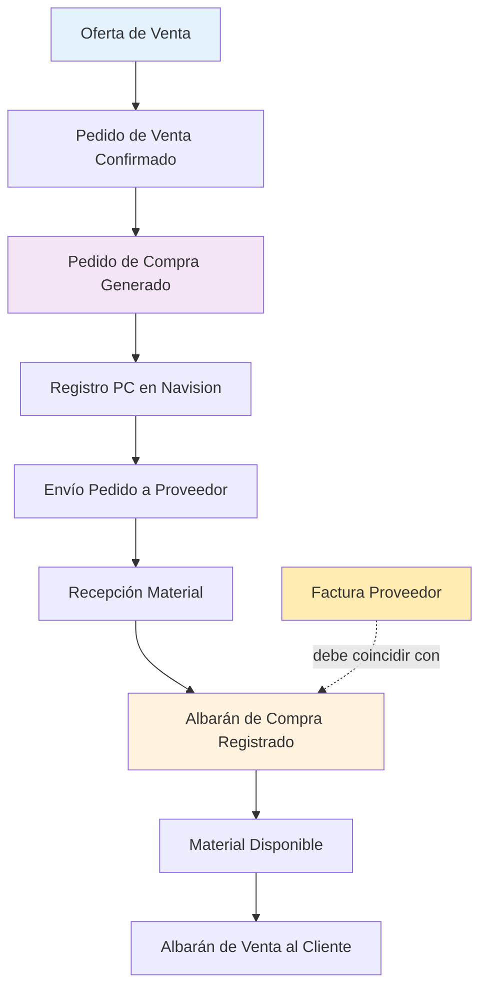

# Proceso de Negocio Actual (AS IS)

*Análisis detallado del funcionamiento real del procesamiento de facturas en DIESSA*

---

## La Realidad Operativa Diaria

El proceso actual de gestión de facturas en DIESSA representa un sistema maduro que ha evolucionado durante décadas para manejar las complejidades específicas del sector de recambios de vehículo industrial. Aunque predominantemente manual, incorpora múltiples niveles de verificación y control que han demostrado su efectividad en un entorno de alta variabilidad.

### El Volumen de la Operación

Cada mes, el departamento de administración de DIESSA procesa entre **180 y 200 facturas** provenientes de una red de **50 a 60 proveedores activos**. Esta cifra representa únicamente las facturas de material directo (piezas de camiones y autobuses), ya que las facturas de servicios siguen un flujo diferente y simplificado.

La responsabilidad de este volumen recae principalmente en **Olga Manzano**, quien ha desarrollado a lo largo de los años una metodología de trabajo altamente especializada que combina conocimiento del negocio, dominio técnico de Navision, y habilidades de investigación que le permiten resolver los casos más complejos.

---

## El Flujo Completo: De la Factura a la Contabilización

### Diagrama General del Proceso

### Fase 1: La Llegada de las Facturas

Las facturas llegan a DIESSA por tres canales principales, cada uno con sus propias características operativas:

**Recepción por Email (Canal Principal)**  
El 95% de las facturas llegan como archivos PDF adjuntos en correos electrónicos. Olga gestiona una bandeja de entrada especializada donde se acumulan diariamente estos documentos. La inmediatez de este canal es crítica para proveedores con domiciliación bancaria, donde el procesamiento debe completarse el mismo día para evitar descoordinaciones financieras.

**Portales Web Especializados**  
Proveedores como Diesel Technic y Eurotrux han implementado sistemas donde las facturas deben descargarse manualmente. Aunque este proceso requiere pasos adicionales, proporciona ventajas significativas: acceso a documentación auxiliar (albaranes de entrega), mejor calidad de imagen, y capacidad de descargar documentos históricos cuando surgen discrepancias.

**Documentación Física**  
Aunque minoritario, algunos proveedores aún envían facturas en papel que requieren escaneo. Este proceso está siendo progresivamente eliminado, pero aún representa casos especiales que deben gestionarse.

### Fase 2: El Análisis Inicial

Una vez que Olga tiene la factura en formato PDF, comienza el proceso de análisis que requiere una comprensión profunda tanto del documento como del proveedor específico.

**Identificación del Proveedor**  
El primer paso crítico es verificar el código de proveedor. DIESSA utiliza un sistema de codificación **PR + 6 dígitos** (ejemplo: PR001147 para Leo Industrial, PR002415 para Sampa). Esta identificación no es trivial, ya que algunos proveedores pueden usar nombres comerciales diferentes en sus facturas.

**Localización de Referencias de Albarán**  
Aquí reside una de las complejidades más significativas del proceso. Cada proveedor incluye referencias a albaranes en ubicaciones diferentes del documento y utilizando formatos completamente distintos. Diesel Technic coloca los números en la cabecera de cada página, Leo Industrial los incluye en el cuerpo de líneas de producto, Sampa los lista en una sección específica al final.

**El Desafío de las 196 Variaciones**  
El análisis de un solo proveedor (Leo Industrial) reveló 196 variaciones diferentes en el formato de entrada de albaranes. Ejemplos reales incluyen: "A25-9981" (formato estándar), "25710" (sin prefijo ni guión), "653" (solo números finales), "ALBC A25-314" (con prefijo adicional). Esta variabilidad refleja la realidad de que diferentes operadores de DIESSA registran la misma información siguiendo criterios personales no estandarizados.

### Fase 3: La Búsqueda en Navision

Con las referencias identificadas, Olga inicia el proceso de localización en Navision, que representa el núcleo técnico de su trabajo diario.

**Estrategia de Búsqueda Primaria**  
Olga accede a Navision y utiliza la función "Acciones → Traer albaranes de compra" para el proveedor específico. Su estrategia, desarrollada por experiencia, es pragmática: *"si sabemos cuáles, o yo no lo sé, me traigo todos y voy mirando"*. Esta aproximación refleja que frecuentemente la información en las facturas es incompleta o ambigua.

**El Matching Visual**  
El proceso de comparación es intensamente visual. Olga trabaja con configuración dual: la factura PDF en una pantalla, Navision con los albaranes disponibles en otra. Esta configuración permite identificar correspondencias mediante comparación directa de números, fechas, importes, y descripciones de productos.

**Gestión de Casos Complejos**  
Cuando el matching directo falla, Olga despliega una metodología investigativa estructurada. Utiliza las capacidades de Navision para rastrear movimientos de piezas específicas, accede a portales de proveedores para verificar albaranes originales, y coordina con gestores internos para obtener contexto adicional sobre registros específicos.

#### **Diagrama: Técnicas de Búsqueda Alternativas**

### Fase 4: La Resolución de Discrepancias

Aproximadamente el 25-35% de las facturas presentan algún tipo de discrepancia que requiere resolución activa.

**Categorización de Problemas**  
La experiencia de Olga ha permitido identificar ocho categorías principales de problemas: olvidos de registro, errores de asignación de proveedor, errores del proveedor en el pedido original, reposiciones por material defectuoso, compras directas no registradas, abonos pendientes, registros con particularidades específicas, y casos que requieren investigación manual completa.

**Metodología de Resolución**  
Para cada categoría, Olga ha desarrollado protocolos específicos. Los olvidos de registro se resuelven contactando al gestor responsable (tiempo típico: 15-30 minutos). Los errores de proveedor requieren comunicación directa para clarificación (30-60 minutos). Las reposiciones pueden requerir 1-3 días esperando documentación de abono.

**Coordinación Interdepartamental**  
La resolución efectiva depende de la colaboración entre áreas. Los gestores responden típicamente en menos de 30 minutos a consultas de Olga. Los comerciales proporcionan contexto sobre compras directas. Fernando López, como supervisor, interviene en casos complejos que requieren decisiones administrativas.

### Fase 5: El Registro Final

Una vez resueltas todas las discrepancias, Olga procede al registro definitivo en Navision.

**Creación del Borrador de Factura**  
El sistema requiere completar múltiples campos obligatorios: número de proveedor, fecha de emisión del documento, fecha de registro (fecha de contabilización en DIESSA), fecha de vencimiento, número de factura del proveedor (que debe coincidir exactamente con el documento original), y texto de registro descriptivo.

**Vinculación de Albaranes**  
Los albaranes identificados se vinculan línea por línea con la factura. Este proceso actualiza automáticamente las cantidades "facturadas" en los albaranes correspondientes y modifica los estados de los pedidos de compra originales.

**Validaciones Finales**  
Antes del registro definitivo, Navision ejecuta múltiples validaciones: coherencia de fechas (registro no puede ser anterior a emisión), unicidad del número de factura por proveedor y año, balances matemáticos entre líneas y totales, y verificación de que los albaranes no hayan sido previamente facturados.

---

## Análisis de Eficiencias y Ineficiencias

### Fortalezas del Proceso Actual

**Flexibilidad Extrema**  
El proceso manual permite manejar la variabilidad extrema que caracteriza el sector. Cada proveedor tiene sus particularidades, cada factura puede presentar casos únicos, y el juicio humano de Olga permite resolución de situaciones que sistemas rígidos no podrían gestionar.

**Calidad de Control**  
La verificación humana proporciona un nivel de control de calidad que detecta errores sutiles: diferencias de precio que pueden indicar errores de registro, cantidades que no coinciden con pedidos, fechas inconsistentes que sugieren problemas en el flujo de entrega.

**Conocimiento Acumulado**  
Olga ha desarrollado conocimiento tácito sobre cada proveedor: cuáles son más propensos a errores, qué tipos de discrepancias son normales vs problemáticas, cuándo vale la pena investigar una diferencia menor vs aceptarla. Este conocimiento no está documentado pero es crítico para la operación.

### Limitaciones Identificadas

**Dependencia de Personal Específico**  
El proceso está altamente centralizado en el conocimiento y experiencia de Olga. Esta concentración crea vulnerabilidad operativa y limita la escalabilidad del proceso.

**Tiempo de Procesamiento Variable**  
Mientras que facturas estándar pueden procesarse en 10-15 minutos, casos complejos (especialmente Diesel Technic con 100+ páginas) pueden requerir múltiples horas de trabajo distribuidas a lo largo de varios días.

**Falta de Trazabilidad Automática**  
Las decisiones tomadas durante el proceso (por qué se aceptó una diferencia, cómo se resolvió una discrepancia) no se documentan sistemáticamente, limitando el aprendizaje organizacional y la mejora continua.

---

## Casos Específicos por Proveedor

### Diesel Technic: El Proveedor Complejo

Diesel Technic representa el paradigma de complejidad gestionada. Sus facturas de 100+ páginas cada 15 días requieren un enfoque específico que Olga ha refinado durante años.

**Estructura Dual de Albaranes**  
Las facturas incluyen dos tipos de albaranes completamente diferentes: transportes (que se suman automáticamente) y piezas (que requieren verificación individual). Esta separación no es estándar en otros proveedores, requiriendo que Olga aplique una metodología específica para Diesel Technic.

**Ventaja del Portal Web**  
Cuando surgen discrepancias, Diesel Technic proporciona acceso a un portal donde Olga puede descargar albaranes específicos para verificación. Esta capacidad convierte problemas potencialmente irresolubles en investigaciones estructuradas.

### Leo Industrial: El Equilibrio

Leo Industrial representa un equilibrio entre volumen y complejidad. Como segundo proveedor en importancia, sus facturas siguen patrones más predecibles, pero aún requieren atención detallada debido al volumen de transacciones.

### Sampa: La Proactividad

Sampa ha implementado una práctica valorada por Olga: envío proactivo de albaranes por email. Esta documentación auxiliar reduce significativamente el tiempo de reconciliación y representa un modelo de colaboración proveedor-cliente.

---

## La Coordinación con el Ecosistema Interno

### Relación con Gestores

Los gestores de DIESSA son responsables de crear los albaranes que Olga debe posteriormente reconciliar con facturas. Esta relación es fundamental para el éxito del proceso, ya que la calidad y precisión del registro inicial determina la complejidad del trabajo posterior.

**Variabilidad en la Precisión**  
La experiencia ha demostrado que existe variabilidad natural entre gestores. Algunos son extremadamente meticulosos y raramente cometen errores, otros pueden ser más propensos a olvidos o imprecisiones. Olga ha desarrollado heurísticas para identificar qué tipos de problemas están asociados con qué gestores.

**Comunicación Activa**  
Cuando surgen discrepancias, Olga contacta directamente con el gestor responsable. Esta comunicación no es conflictiva sino colaborativa: los gestores entienden que la precisión de Olga beneficia a toda la operación y responden típicamente en menos de 30 minutos.

### Coordinación con Comerciales

Los comerciales generan la demanda inicial que eventualmente se convierte en pedidos de compra y albaranes. Cuando Olga encuentra material facturado sin albarán correspondiente, debe investigar si se trata de una "compra directa" realizada por un comercial sin seguir el proceso formal.

**Gestión de Urgencias**  
El sector del transporte genera urgencias reales: un camión parado por falta de una pieza específica representa pérdidas económicas inmediatas para el cliente. En estas situaciones, los comerciales pueden contactar directamente con proveedores, creando posteriormente la necesidad de "regularizar" estas operaciones en el sistema.

---

## El Conocimiento Tácito en Acción

### Heurísticas Desarrolladas

Olga ha desarrollado múltiples heurísticas que guían su trabajo diario:

**Criterios de Materialidad**: Diferencias de precio menores (2-3 euros) se aceptan sin investigación, diferencias significativas requieren clarificación completa.

**Patrones por Proveedor**: Cada proveedor tiene tendencias específicas en tipos de errores, frecuencia de discrepancias, y métodos de resolución más efectivos.

**Gestión Temporal**: Facturas con domiciliación bancaria reciben prioridad absoluta, facturas complejas se procesan en momentos de menor presión operativa.

---

## Conclusión: Un Sistema Maduro y Optimizado

El proceso actual de DIESSA representa un ejemplo de optimización práctica para un entorno de alta complejidad y variabilidad. Aunque predominantemente manual, incorpora eficiencias desarrolladas durante años de experiencia operativa.

La aparente "ineficiencia" del proceso manual oculta una sofisticación considerable: cada paso existe porque resuelve un problema real del negocio, cada heurística refleja aprendizaje acumulado sobre cómo funciona realmente el sector de recambios.

Cualquier iniciativa de automatización debe respetar estas realidades operativas, complementando las fortalezas del proceso actual mientras aborda sus limitaciones estructurales. El objetivo no es reemplazar el juicio humano, sino augmentarlo con herramientas que manejen los casos rutinarios y permitan que la experiencia humana se concentre en las situaciones que realmente requieren interpretación especializada.

---

## Flujo de Pedidos: El Contexto Completo

Para comprender completamente el proceso de facturas, es esencial entender el flujo previo que genera los albaranes que Olga debe reconciliar:

### Diagrama: Del Pedido al Albarán

### Explicación del Flujo de Pedidos

**Secuencia Crítica**: Como explica Olga: *"Para crear un pedido de compra, primero tienen que hacer la venta, es decir, primero tienen que generar el pedido de venta para poder hacer el pedido de compra"*.

1. **Oferta de Venta → Pedido de Venta**: Conversión de oferta comercial a pedido confirmado
2. **Pedido de Venta → Pedido de Compra**: Generación automática de pedido al proveedor
3. **Registro PC**: Asignación de número PC (Pedido Compra) en Navision
4. **Albarán de Compra**: Cuando llega la mercancía, se registra la recepción
5. **Retorno al Pedido de Venta**: Para generar albarán de venta al cliente

**Punto crítico**: Los albaranes que Olga reconcilia en el proceso de facturas son el resultado de esta cadena completa. Cualquier error o inconsistencia en el flujo previo se manifiesta como problemas en el proceso de reconciliación.

### Flujo Visual Documentado con Olga

*Diagrama original creado tras la conversación con Olga que ilustra la secuencia completa desde ofertas hasta albaranes de venta.*

---

*Este análisis está basado en la transcripción de 55 minutos de la reunión del 19 de marzo de 2025 con Olga Manzano, documentación técnica de ARES, análisis de emails operativos, y observación directa de procesos durante múltiples sesiones de trabajo.*