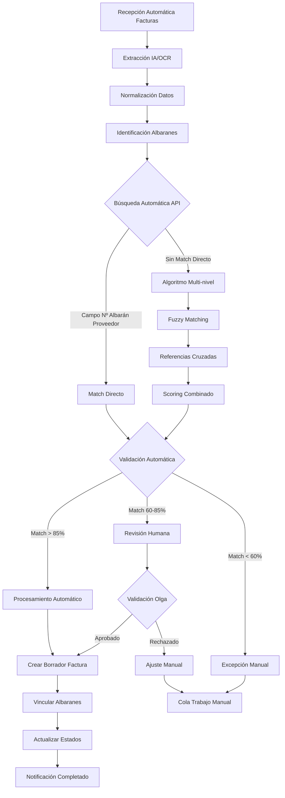

# Proceso de Negocio Objetivo (TO BE)

## Visión General

El proceso objetivo automatiza las tareas manuales repetitivas mientras mantiene los puntos de control y validación humana donde aportan valor. La solución se basa en la integración de tecnologías de IA, automatización con n8n y la API de Navision.

## Flujo Automatizado Propuesto

