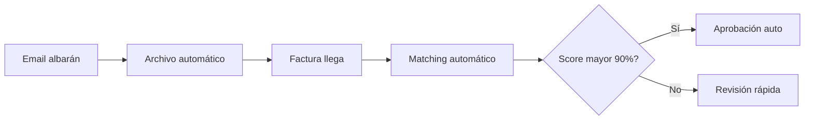

# Sampa Ibérica S.L.

## Información General
- **Código**: PR002415
- **Volumen**: 10-15 facturas/mes
- **Complejidad**: BAJA
- **Canal**: Email automatizado

## Características Positivas

### Mejor Organización
- Envío automático de albaranes por email
- Archivos PDF bien nombrados
- Organización cronológica clara
- Formato consistente

### Ventajas para Automatización
- Referencias estandarizadas
- Fácil localización en bandeja entrada
- Albaranes llegan antes que facturas
- Menos variaciones de formato

## Casuísticas y Escenarios

### Caso 1: Proceso Estándar
- **Frecuencia**: 90% de casos
- **Patrón**: Factura menciona albaranes ya recibidos
- **Solución**: Matching automático alta confianza

### Caso 2: Albaranes Faltantes
- **Frecuencia**: 5% de casos
- **Problema**: Email albarán no llegó
- **Solución**: Solicitud automática reenvío

### Caso 3: Agrupación Múltiple
- **Frecuencia**: 5% de casos
- **Situación**: Una factura agrupa muchos albaranes
- **Solución**: Procesamiento batch optimizado

## Reglas de Negocio

1. **Prioridad alta**: Por buena organización
2. **Confianza elevada**: 90% aprobación automática
3. **Tiempo archivo**: Albaranes en carpeta 30 días
4. **Notificaciones**: Alertar si no llega albarán esperado

## Configuración Sistema

```javascript
{
  "proveedor": "PR002415",
  "algoritmo": "email_automated",
  "parametros": {
    "fuenteAlbaranes": "email",
    "confianzaBase": 0.90,
    "ventanaBusqueda": 14,
    "archivoAutomatico": true,
    "alertasFaltantes": true
  }
}
```

## Proceso Optimizado



## Métricas Específicas
- **Tiempo proceso actual**: 2-3 min/factura
- **Objetivo automatización**: 15 seg/factura
- **Tasa error actual**: 5%
- **Objetivo error**: menor 1%

## Recomendaciones
Este proveedor es ideal para:
1. Piloto inicial por simplicidad
2. Caso de éxito demostrable
3. Benchmark para otros proveedores

---

*Proveedor modelo - Ejemplo de best practices*