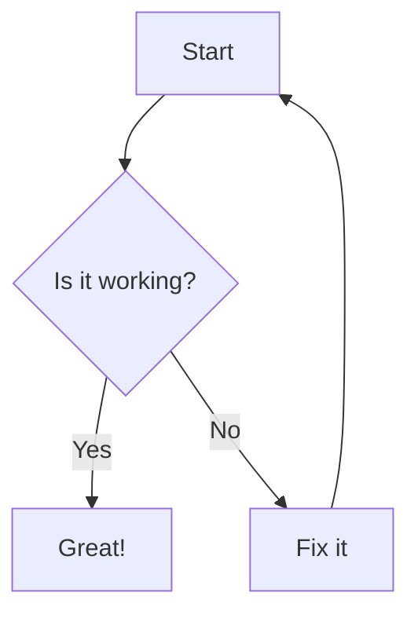
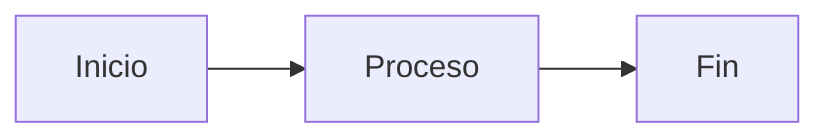

# Test de Diagramas Mermaid

## Diagrama Simple

```mermaid
graph TD
    A[Start] --> B{Is it working?}
    B -->|Yes| C[Great!]
    B -->|No| D[Fix it]
    D --> A
```

## Diagrama de Flujo

```mermaid
flowchart LR
    A[Inicio] --> B[Proceso]
    B --> C[Fin]
```